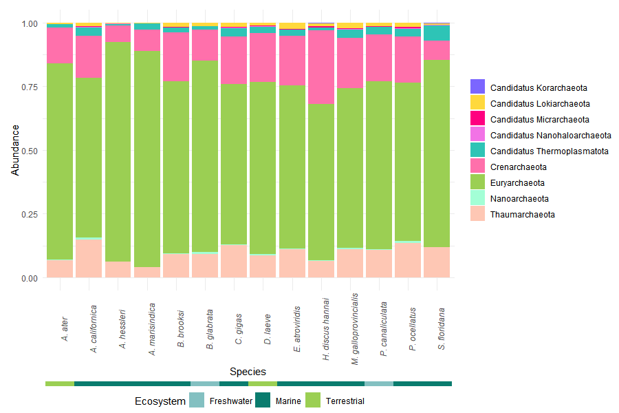
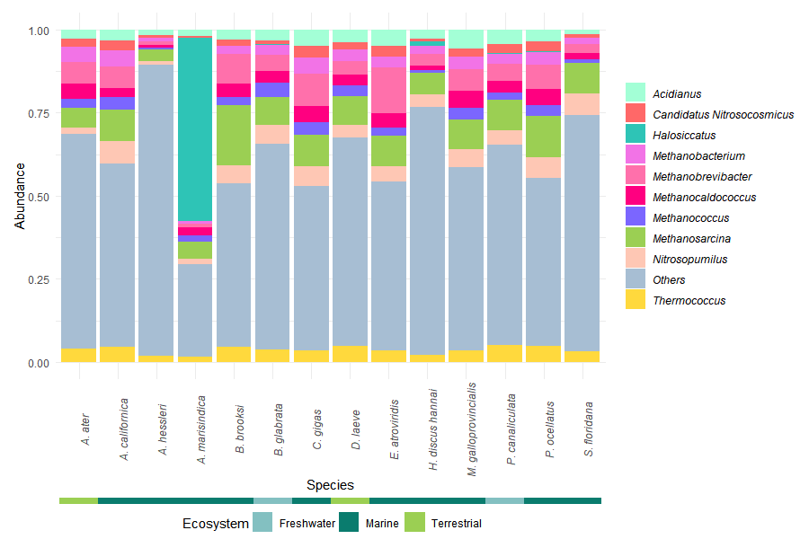
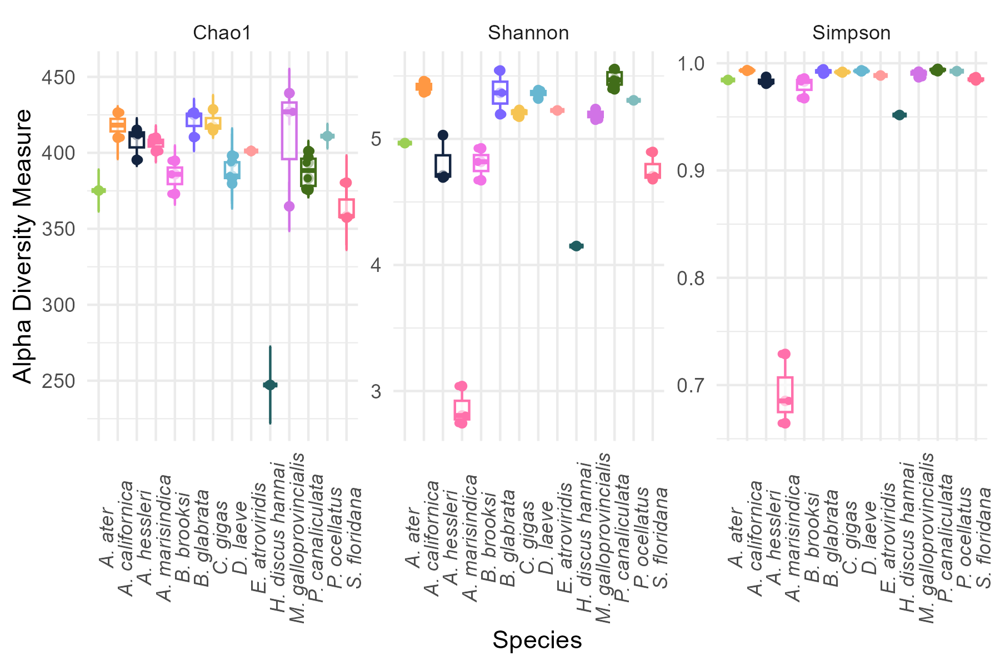
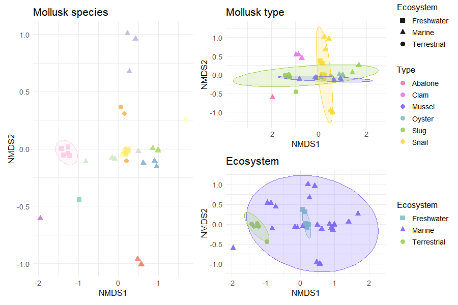
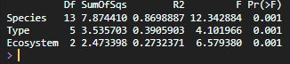
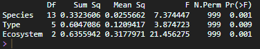

  
To contextualize the microbiota of *Deroceras laeve*, a comparative analysis was conducted using publicly available metagenomic datasets from other mollusk species.

This approach allowed the identification of shared and distinct microbial patterns across taxa, as well as the exploration of ecological and host-associated influences on microbiota composition.

## Data Integration and Preprocessing

Metagenomic datasets from additional mollusk species were retrieved from public repositories and processed using the same taxonomic classification pipeline.

All datasets were combined into a single BIOM table and imported into R using the `phyloseq` package, allowing standardized downstream analyses.

Taxonomic labels were cleaned to remove database-specific prefixes, ensuring consistent downstream processing. The dataset was filtered to retain only archaeal sequences and remove unclassified genera.

```{r, eval=FALSE}
library(phyloseq)
library(ggplot2)
library(dplyr)
library(patchwork)
library(vegan)

mollusk_physeq <- import_biom("mollusk_metag_species.biom")

# Clean taxonomy prefixes
mollusk_physeq@tax_table@.Data <-
  substring(mollusk_physeq@tax_table@.Data, 4)

colnames(mollusk_physeq@tax_table@.Data) <- c(
  "Kingdom", "Phylum", "Class",
  "Order", "Family", "Genus", "Species"
)

# Filter Archaea
mollusk_physeq <- subset_taxa(mollusk_physeq, Kingdom == "Archaea")
mollusk_physeq <- subset_taxa(mollusk_physeq, Genus != "")
```

## Metadata Construction

Metadata were extracted directly from the phyloseq object and augmented with manually curated biological information, including host type (e.g., slug, snail) and ecosystem (terrestrial, freshwater, marine).

A simplified species label was generated to improve visualization and readability in downstream plots.

```{r, eval=FALSE}

metadata <- as(sample_data(mollusk_physeq), "data.frame")
metadata$SampleID <- rownames(metadata)

mollusk_info <- data.frame(
  Species_full = c("Deroceras laeve","Arion ater","Biomphalaria glabrata",
                   "Pomacea canaliculata","Alviniconcha marisindica",
                   "Alviniconcha hessleri","Aplysia californica",
                   "Elysia atroviridis","Plakobranchus ocellatus",
                   "Haliotis discus hannai","Mytilus galloprovincialis",
                   "Bathymodiolus brooksi","Crassostrea gigas",
                   "Stewartia floridana"),
  Type = c("Slug","Slug","Snail","Snail","Snail","Snail",
           "Slug","Slug","Slug","Abalone","Mussel","Mussel","Oyster","Clam"),
  Ecosystem = c("Terrestrial","Terrestrial","Freshwater","Freshwater",
                "Marine","Marine","Marine","Marine","Marine",
                "Marine","Marine","Marine","Marine","Marine")
)

metadata <- left_join(
  metadata,
  mollusk_info,
  by = c("Mollusk_species" = "Species_full")
)

species_labels <- c(
  "Deroceras laeve"="D. laeve","Arion ater"="A. ater",
  "Biomphalaria glabrata"="B. glabrata",
  "Pomacea canaliculata"="P. canaliculata",
  "Alviniconcha hessleri"="A. hessleri",
  "Alviniconcha marisindica"="A. marisindica",
  "Aplysia californica"="A. californica",
  "Elysia atroviridis"="E. atroviridis",
  "Plakobranchus ocellatus"="P. ocellatus",
  "Bathymodiolus brooksi"="B. brooksi",
  "Crassostrea gigas"="C. gigas",
  "Haliotis discus hannai"="H. discus hannai",
  "Mytilus galloprovincialis"="M. galloprovincialis",
  "Stewartia floridana"="S. floridana"
)

metadata$Species <- species_labels[metadata$Mollusk_species]
```

## Taxonomic analysis

### Relative Abundance Analysis

Counts were transformed into relative abundances (percentages) to allow comparison across samples with different sequencing depths.

Taxa were aggregated at the phylum and genus levels using taxonomic glomeration.

```{r, eval=FALSE}
percentages <- transform_sample_counts(
  mollusk_physeq,
  function(x) x * 100 / sum(x)
)
```

### Phylum-Level Composition

The ten most abundant phyla were selected based on mean relative abundance across samples. Remaining taxa were grouped as "Others" to simplify visualization.

A secondary annotation bar was added to indicate the ecosystem associated with each host species, providing ecological context to taxonomic patterns.

```{r, eval=FALSE}
phylum_glom <- tax_glom(percentages, taxrank = "Phylum")
phylum_df <- psmelt(phylum_glom)

phylum_df <- phylum_df %>%
  left_join(
    metadata[, c("SampleID","Species","Ecosystem")],
    by = c("Sample"="SampleID")
  )

top_phyla <- phylum_df %>%
  group_by(Phylum) %>%
  summarise(Abundance = mean(Abundance)) %>%
  arrange(desc(Abundance)) %>%
  slice_head(n = 10)

phylum_df <- phylum_df %>%
  mutate(Phylum = ifelse(Phylum %in% top_phyla$Phylum, Phylum, "Others"))
```

Custom colors:
  
```{r, eval=FALSE}

colors <- c("#9BCF53", "#FFD93D", "#FF70AB", "#A3FFD6",
            "#FEC7B4", "#83C0C1", "#FF0080", "#F273E6",
            "#7B66FF", "#FFF67E")

ecosystem_colors <- c(
  "Terrestrial" = "#9BCF53",
  "Freshwater" = "#83C0C1",
  "Marine" = "#0A7C6E"
)

colors_by_phylum <- setNames(colors, top_phyla$Phylum)
colors_by_phylum["Others"] <- "#A7BED3"
```

Plot:
  
```{r, eval=FALSE}

main_plot <- ggplot(phylum_df, aes(x = Species, y = Abundance, fill = Phylum)) +
  geom_bar(stat = "identity", position = "fill") +
  scale_y_continuous(labels = scales::percent) +
  scale_fill_manual(values = colors_by_phylum) +
  theme_minimal() +
  theme(axis.text.x = element_text(angle = 90, face = "italic"))

ecosystem_bar <- ggplot(phylum_df, aes(x = Species, fill = Ecosystem)) +
  geom_tile(aes(y = 1)) +
  scale_fill_manual(values = ecosystem_colors) +
  theme_void()  +
  theme(
    legend.position = "bottom"
  )

main_plot / ecosystem_bar + plot_layout(heights = c(1, 0.02))
```



### Genus-Level Composition

A similar approach was applied at the genus level to explore finer taxonomic resolution.

```{r, eval=FALSE}

genus_glom <- tax_glom(percentages, taxrank = "Genus")
genus_df <- psmelt(genus_glom)

top_genus <- genus_df %>%
  group_by(Genus) %>%
  summarise(Abundance = mean(Abundance)) %>%
  arrange(desc(Abundance)) %>%
  slice_head(n = 10)

genus_df <- genus_df %>%
  mutate(Genus = ifelse(Genus %in% top_genus$Genus, Genus, "Others"))

genus_df <- genus_df %>%
  left_join(
    metadata[, c("SampleID","Species","Ecosystem")],
    by = c("Sample"="SampleID")
  )

```

Custom colors:
  
```{r, eval=FALSE}

colors <- c("#9BCF53", "#FF70AB", "#FEC7B4", "#2EC4B6",
            "#FFD93D", "#A3FFD6", "#FF0080", "#F273E6",
            "#7B66FF", "#FF6868")

colors_by_genus <- setNames(colors, top_genus$Genus)
colors_by_genus["Others"] <- "#A7BED3"

```

Plot:
  
```{r, eval=FALSE}

main_plot <- ggplot(genus_df, aes(x = Species, y = Abundance, fill = Genus)) +
  geom_bar(stat = "identity", position = "fill") +
  scale_y_continuous(labels = scales::percent) +
  scale_fill_manual(values = colors_by_genus) +
  theme_minimal() +
  theme(axis.text.x = element_text(angle = 90, face = "italic"),
        legend.text = element_text(face = "italic")
  )

ecosystem_bar <- ggplot(phylum_df, aes(x = Species, fill = Ecosystem)) +
  geom_tile(aes(y = 1)) +
  scale_fill_manual(values = ecosystem_colors) +
  theme_void()  +
  theme(
    legend.position = "bottom"
  )

main_plot / ecosystem_bar + plot_layout(heights = c(1, 0.02))

```



## Alpha Diversity

Alpha diversity was assessed using three complementary indices:
  
-   Chao1 (richness estimator)
-   Shannon (richness and evenness)
-   Simpson (dominance/evenness)

All indices were visualized simultaneously to enable direct comparison across mollusk species.

Custom colors:

```{r, eval=FALSE}
colors <- c(
  "#9BCF53", "#FF9843", "#132440", "#FF70AB", "#F273E6", "#7B66FF", 
  "#F6C453", "#67B7D1", "#FF9B9B", "#215E61", "#D173E6", "#416D19",
  "#80BCBD", "#FF6E94", "#640D5F")
```

Plot:

```{r, eval=FALSE}
plot_richness(
  physeq = mollusk_physeq,
  x = "Mollusk_species",
  color = "Mollusk_species",
  measures = c("Chao1", "Shannon", "Simpson")
) +
  geom_boxplot(alpha = 0.6, outlier.shape = NA) +
  geom_point(size = 2.5, position = position_jitter(width = 0.2)) +
  scale_color_manual(values = colors) +
  theme_minimal() +
  theme(axis.text.x = element_text(angle = 90, face = "italic"),
        legend.position = "none")
```



### Statistical Analysis

Differences in alpha diversity across species were evaluated using the Kruskal--Wallis test, a non-parametric alternative to ANOVA, suitable for ecological data that do not meet normality assumptions.

When significant differences were detected, pairwise comparisons were performed using Dunn's test with Benjamini--Hochberg correction to control for multiple testing.

```{r, eval=FALSE}

alpha_df <- estimate_richness(
  mollusk_physeq, 
  measures = c("Chao1", "Shannon", "Simpson")
)

alpha_df$Mollusk_species <- sample_data(mollusk_physeq)$Mollusk_species

kruskal.test(Shannon ~ Mollusk_species, data = alpha_df)

#Post hoc test
library(FSA)
dunnTest(Shannon ~ Mollusk_species, data = alpha_df, method = "bh")

```

## Beta Diversity (NMDS)

Community composition differences were assessed using Bray--Curtis dissimilarity, a metric commonly used in ecological studies.

Non-metric multidimensional scaling (NMDS) was applied to visualize similarities between samples in reduced dimensional space.

Ellipses were included to highlight group-level clustering patterns.

```{r, eval=FALSE}

dist_bc <- phyloseq::distance(mollusk_physeq, method = "bray")

set.seed(123)
nmds_bc <- metaMDS(dist_bc, k = 2, trymax = 100)

nmds_df <- as.data.frame(nmds_bc$points)
nmds_df$SampleID <- rownames(nmds_df)

nmds_df <- nmds_df %>%
  left_join(metadata, by = "SampleID")

```

Plot:

```{r, eval=FALSE}

# NMDS by species
p_species <- ggplot(
  nmds_df,
  aes(
    x = NMDS1,
    y = NMDS2,
    color = Mollusk_species,
    shape = Ecosystem
  )
) +
  geom_point(size = 3, alpha = 0.9) +
  stat_ellipse(
    aes(
      group = Mollusk_species,
      fill = Mollusk_species,
      color = Mollusk_species
    ),
    geom = "polygon",
    alpha = 0.2,
    show.legend = FALSE
  ) +
  scale_color_manual(
    values = colors,
    guide = guide_legend(
      title.theme = element_text(size = 12),
      label.theme = element_text(face = "italic", size = 11)
    )
  ) +
  scale_fill_manual(values = colors, guide = "none") +
  scale_shape_manual(
    values = c(15, 17, 19)
  ) +
  theme_minimal() +
  labs(title = "Mollusk Species") +
  theme(
    text = element_text(size = 12)
  )

# NMDS by type
p_type <- ggplot(
  nmds_df,
  aes(
    x = NMDS1,
    y = NMDS2,
    color = Type,
    shape = Ecosystem
  )
) +
  geom_point(size = 3, alpha = 0.9) +
  stat_ellipse(
    aes(
      group = Type,
      fill = Type,
      color = Type
    ),
    geom = "polygon",
    alpha = 0.2,
    show.legend = FALSE
  ) +
  scale_color_manual(values = colors) +
  scale_fill_manual(values = colors, guide = "none") +
  scale_shape_manual(values = c(15, 17, 19)) +
  theme_minimal() +
  labs(title = "Mollusk Type") +
  theme(
    text = element_text(size = 12)
  )

# NMDS by ecosystem
p_ecosystem <- ggplot(
  nmds_df,
  aes(
    x = NMDS1,
    y = NMDS2,
    color = Ecosystem,
    shape = Ecosystem
  )
) +
  geom_point(size = 3, alpha = 0.9) +
  stat_ellipse(
    aes(
      group = Ecosystem,
      fill = Ecosystem,
      color = Ecosystem
    ),
    geom = "polygon",
    alpha = 0.2,
    show.legend = FALSE
  ) +
  scale_color_manual(values = ecosystem_colors) +
  scale_fill_manual(values = ecosystem_colors, guide = "none") +
  scale_shape_manual(values = c(15, 17, 19)) +
  theme_minimal() +
  labs(title = "Ecosystem") +
  theme(
    text = element_text(size = 12)
  )

# Combine plots
final_plot <- (p_species | (p_type / p_ecosystem)) +
  plot_layout(widths = c(1.5, 1))

final_plot

```



## PERMANOVA

Permutational multivariate analysis of variance (PERMANOVA) was used to test whether microbial community composition differed significantly between groups (species, type, and ecosystem).

This method evaluates whether centroids of groups differ in multivariate space.

```{r, eval=FALSE}

adonis2(dist_bc ~ Mollusk_species, data = metadata)
adonis2(dist_bc ~ Type, data = metadata)
adonis2(dist_bc ~ Ecosystem, data = metadata)

```



### Dispersion Analysis

To validate PERMANOVA results, homogeneity of multivariate dispersion was assessed using the betadisper function.

This analysis evaluates whether differences detected by PERMANOVA are associated with changes in community composition rather than unequal within-group variability.

```{r, eval=FALSE}

# Species dispersion
disp_species <- betadisper(
  dist_bc,
  metadata$Mollusk_species
)

# Type dispersion
disp_type <- betadisper(
  dist_bc,
  metadata$Type
)

# Ecosystem dispersion
disp_ecosystem <- betadisper(
  dist_bc,
  metadata$Ecosystem
)

# Permutation tests
permutest_species <- permutest(
  disp_species,
  permutations = 999
)

permutest_type <- permutest(
  disp_type,
  permutations = 999
)

permutest_ecosystem <- permutest(
  disp_ecosystem,
  permutations = 999
)

# Results
print(permutest_species)
print(permutest_type)
print(permutest_ecosystem)

```



## Adaptation to Other Taxa

The same analytical framework can be applied to other microbial groups by modifying the selected taxonomic subset according to the rank of interest and the structure of the dataset.

For example, some groups can be selected directly at the Kingdom level:

```{r, eval=FALSE}

subset_taxa(dlaeve_physeq, Kingdom == "Bacteria")
mollusk_physeq <- subset_taxa(mollusk_physeq, Genus != "")

subset_taxa(dlaeve_physeq, Kingdom == "Viruses")
mollusk_physeq <- subset_taxa(mollusk_physeq, Genus != "")

```

In other cases, more specific taxonomic ranks may be used. For fungal analyses, representative phyla were selected as follows:

```{r, eval=FALSE}

subset_taxa( dlaeve_physeq, 
             Phylum %in% c("Ascomycota", "Basidiomycota", "Microsporidia" )
  )
mollusk_physeq <- subset_taxa(mollusk_physeq, Genus != "")

```
