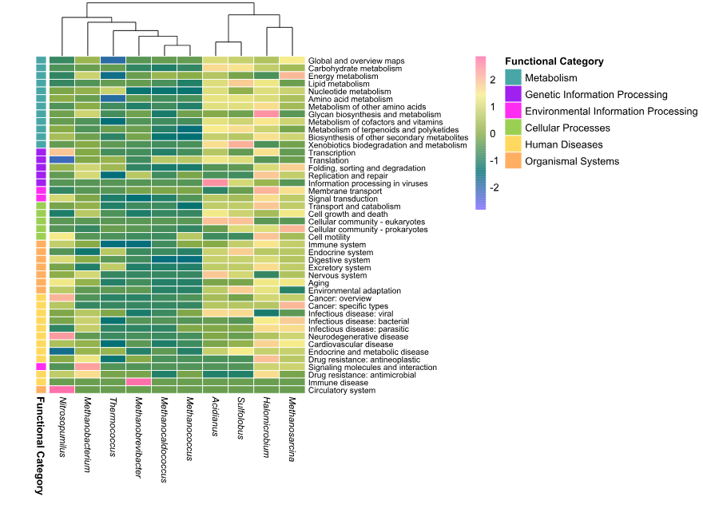
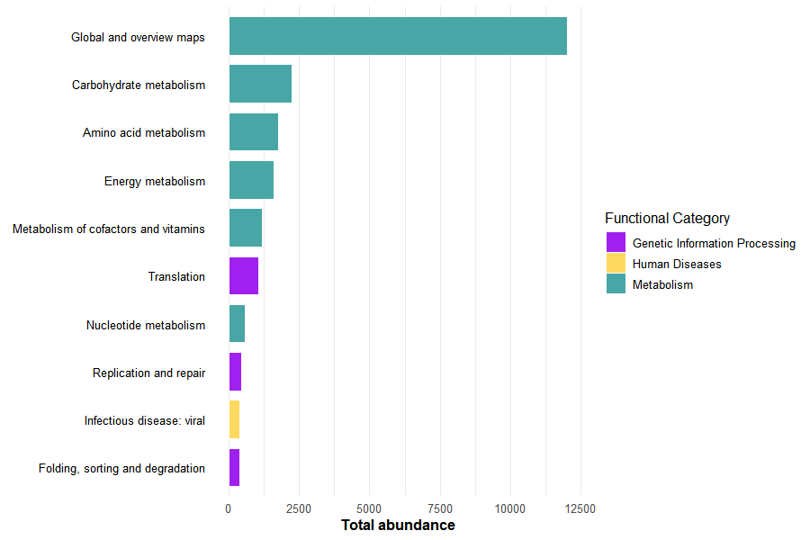

To complement taxonomic characterization, a curated functional inference workflow was conducted to explore the potential biological roles associated with dominant microbial genera detected in *Deroceras laeve*.

## Selection of Representative Taxa

The ten most abundant microbial genera identified from relative abundance profiles were used as the basis for downstream functional analyses.

For each genus, two representative species were selected according to abundance patterns and reference genome availability.

## Retrieval of Reference Proteomes

Protein datasets were obtained from the NCBI RefSeq database using the `datasets` command-line tool.

``` bash
module load ncbi-datasets/14.9.0

download_genome() {
  local accession=$1
  local dir_name=$2

  datasets download genome accession $accession --include protein
  mv ncbi_dataset.zip ${dir_name}.zip
  unzip ${dir_name}.zip
  mv ncbi_dataset/ $dir_name
}

download_genome GCF_016861625.1 Acidianus
download_genome GCF_009617995.1 Halomicrobium
```

Equivalent downloads were performed for all selected representative taxa.

## Functional Annotation with KEGG Tools

Protein files were functionally annotated using:

-   GhostKOALA

-   KAAS (KEGG Automatic Annotation Server)

These tools assign KEGG Orthology identifiers (K numbers) through homology-based comparisons against curated KEGG references.

## Pathway Reconstruction

Annotated KO terms were integrated in KEGG Mapper (Reconstruct) to visualize metabolic and cellular pathways.

Major categories included:

-   Metabolism

-   Translation

-   DNA replication and repair

-   Protein folding

-   Signal transduction

-   Environmental information processing

### KEGG Mapper Output Files

Each KEGG annotation generated multiple output files per genus. These included general summaries, adjacency lists, and sequence count tables.

For this analysis, only the `Sequence_counts` files were used, as they provide a quantitative summary of functional assignments.

Each row in these files represents:

-   A major KEGG functional category (e.g., Metabolism)\
-   A specific subcategory (e.g., Carbohydrate metabolism)\
-   The number of protein sequences assigned to that function

This structure allows the comparison of functional profiles across different microbial genera.

Other output files (e.g., adjacency lists) were not included in this workflow, as the focus of this analysis was on functional abundance rather than network relationships.

### Example of KEGG Output Structure

A simplified example of the structure of a `Sequence_counts` file is shown below:

| Category                       | Subcategory             | Count |
|--------------------------------|-------------------------|-------|
| Metabolism                     | Carbohydrate metabolism | 152   |
| Metabolism                     | Energy metabolism       | 98    |
| Genetic Information Processing | Translation             | 210   |
| Cellular Processes             | Cell motility           | 45    |

These values were used to construct the functional abundance matrix used in the heatmap and barplot visualizations.

## Import and Organize Functional Data

The following command identifies all KEGG Mapper output files corresponding to sequence counts, ensuring that only quantitative functional summaries are included in the analysis.

```{r, eval=FALSE}
library(tidyverse)
library(pheatmap)
library(tibble)

input_dir <- "data/functional_analysis/protein_archaea"

archaeal_files <- list.files(
  path = input_dir,
  pattern = "Sequence_counts$",
  full.names = TRUE
)
```

Each file is then read and labeled according to its corresponding genus. This step ensures that all datasets share a consistent structure.

```{r, eval=FALSE}
genus_tables <- list()

for (file in archaeal_files) {

  genus_name <- str_extract(
    basename(file),
    "(?<=Kegg_mapper_).*?(?=\\.txt)"
  )

  genus_name <- str_to_title(tolower(genus_name))

  genus_data <- read.delim(
    file,
    header = FALSE,
    sep = "\t",
    stringsAsFactors = FALSE
  )

  colnames(genus_data) <- c("Category", "Subcategory", "Count")

  genus_data$Genus <- genus_name

  genus_tables[[genus_name]] <- genus_data
}
```

### Build the Functional Matrix

All individual tables are merged into a single dataset and reshaped into a wide-format matrix, where:

-   rows represent functional subcategories
-   columns represent genera
-   values represent sequence counts

```{r, eval=FALSE}
combined_data <- bind_rows(genus_tables)

functional_wide <- combined_data %>%
  pivot_wider(
    names_from = Genus,
    values_from = Count,
    values_fill = list(Count = 0)
  )
```

This table is then converted into a numeric matrix suitable for heatmap visualization.

```{r, eval=FALSE}
colnames(functional_wide)[1] <- "Functional_Category"

heatmap_matrix <- functional_wide %>%
  column_to_rownames("Subcategory") %>%
  select(-Functional_Category) %>%
  as.matrix()
```

### Functional Annotations and Color Design

To improve interpretation, each subcategory is linked to a broader KEGG class (e.g., metabolism or cellular processes). These categories are also used to define a consistent color scheme.

```{r, eval=FALSE}
row_annotations <- functional_wide %>%
  select(Subcategory, Functional_Category) %>%
  distinct() %>%
  column_to_rownames("Subcategory")

colnames(row_annotations) <- "Functional Category"

annotation_colors <- list(
  "Functional Category" = c(
    "Metabolism" = "#48A6A7",
    "Genetic Information Processing" = "purple",
    "Environmental Information Processing" = "#FF2DF1",
    "Cellular Processes" = "#9BCF53",
    "Human Diseases" = "#FFD95F",
    "Organismal Systems" = "#FFAF61"
  )
)
```

In addition, a continuous color gradient was applied to represent relative abundance values across the matrix.

```{r, eval=FALSE}
heatmap_palette <- colorRampPalette(
  c("#7B66FF", "#007074", "#89AC46", "#F8ED8C", "#FF70AB")
  )(256)
```

## Heatmap Visualization

The heatmap was generated using row scaling to highlight relative differences in functional abundance across genera.

Column clustering was applied to identify similarities between genera, while row order was preserved for biological interpretability.

```{r, eval=FALSE}
italic_labels <- lapply(
  colnames(heatmap_matrix),
  function(x) bquote(italic(.(x)))
)

pheatmap(
  heatmap_matrix,
  cluster_rows = FALSE,
  cluster_cols = TRUE,
  show_rownames = TRUE,
  fontsize_row = 8,
  fontsize_col = 9,
  labels_col = as.expression(italic_labels),
  color = heatmap_palette,
  scale = "row",
  annotation_row = row_annotations,
  annotation_colors = annotation_colors,
  border_color = "white",
  cellwidth = 25,
  cellheight = 7.5
)
```

{width="100%"}

## Dominant Functional Categories

To complement the heatmap, the most abundant functional subcategories were identified across all genera.

```{r, eval=FALSE}
top_functions <- combined_data %>%
  group_by(Subcategory, Category) %>%
  summarise(Total = sum(Count), .groups = "drop") %>%
  arrange(desc(Total)) %>%
  slice_head(n = 10)
```

This allows highlighting the dominant biological processes contributing to the overall functional profile.

### Barplot Visualization

A barplot was generated using the same category color scheme as the heatmap, ensuring visual consistency across figures.

```{r, eval=FALSE}
barplot_archaea <- ggplot(
  top_functions,
  aes(
    x = reorder(Subcategory, Total),
    y = Total,
    fill = Category
  )
) +
  geom_col(width = 0.8, color = "white", linewidth = 0.2) +
  scale_fill_manual(
    values = annotation_colors[["Functional Category"]],
    name = "Functional Category"
  ) +
  coord_flip() +
  labs(
    x = NULL,
    y = "Total abundance"
  ) +
  theme_minimal(base_size = 12) +
  theme(
    axis.text.y = element_text(size = 10, color = "black"),
    axis.title.x = element_text(face = "bold"),
    legend.position = "none",
    panel.grid.major.y = element_blank()
  )

barplot_archaea
```



## Functional Overview

Together, these visualizations summarize both the global functional structure and the most dominant biological processes across archaeal genera.

## Extension to Other Microbial Groups

The workflow described above can be directly applied to other microbial domains by modifying the input directory containing KEGG Mapper outputs.

For example:

#### Bacteria

```{r, eval=FALSE}
input_dir \<- "data/functional_analysis/protein_bacteria"
```

#### Fungi

```{r, eval=FALSE}
input_dir \<- "data/functional_analysis/protein_fungi"
```

#### Viruses

```{r, eval=FALSE}
input_dir \<- "data/functional_analysis/protein_viruses"
```
