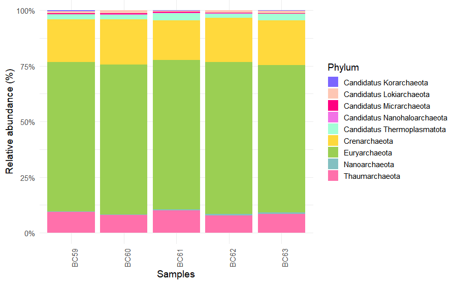
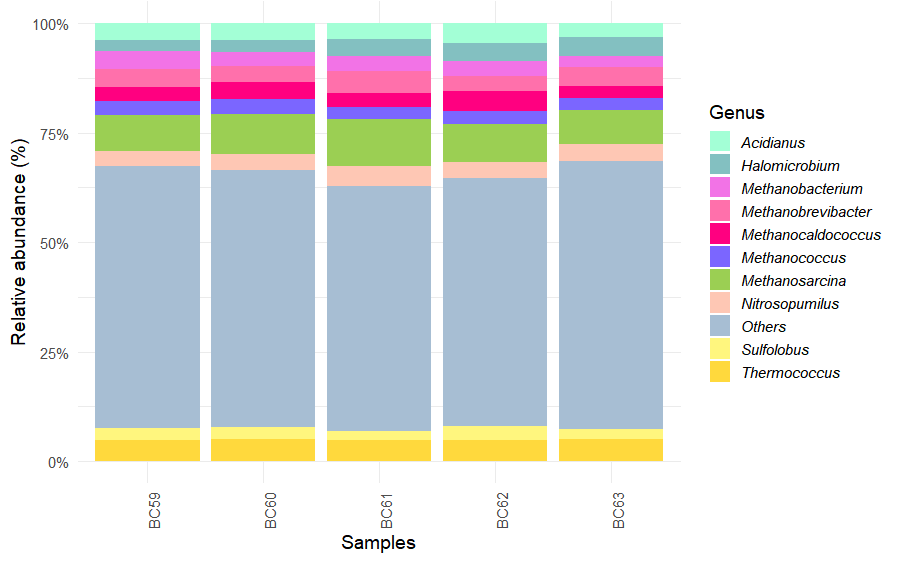

Following taxonomic classification and exploratory visualization, downstream analyses were conducted in R to characterize microbial groups associated with *Deroceras laeve*.

This chapter presents an example workflow using Archaea as a representative taxonomic subset. The same strategy can be applied to Bacteria, Fungi, Viruses, or other groups of interest by modifying the selected taxonomic level.

# Input Data {.unnumbered}

Kraken2-derived BIOM files were imported into R using the `phyloseq` package.

```{r, eval=FALSE}
library(phyloseq)
library(ggplot2)
library(dplyr)

dlaeve_physeq <- import_biom("dlaeve_taxonomy.biom")
```

Taxonomic labels were curated by removing unnecessary prefixes and assigning standardized rank names.

```{r, eval=FALSE}
dlaeve_physeq@tax_table@.Data <-
  substring(dlaeve_physeq@tax_table@.Data, 4)

colnames(dlaeve_physeq@tax_table@.Data) <- c(
  "Kingdom", "Phylum", "Class",
  "Order", "Family", "Genus", "Species"
)
```

## Example Workflow: Archaea 

Taxonomic Selection

Reads assigned to Archaea were extracted for focused downstream analyses.

```{r, eval=FALSE}

archaea <- subset_taxa(
  dlaeve_physeq,
  Kingdom == "Archaea"
)

```

### Removal of Unidentified Genera 

Only classified genera were retained for abundance summaries and visualization.

```{r, eval=FALSE}

archaea <- subset_taxa(
  archaea,
  Genus != ""
)

```

### Relative Abundance Transformation

```{r, eval=FALSE}

percentages <- transform_sample_counts(
  archaea,
  function(x) x * 100 / sum(x)
)

```

## Phylum-Level Summarization 

```{r, eval=FALSE}

percentages_glom <- tax_glom(
  percentages,
  taxrank = "Phylum"
)

percentages_df <- psmelt(
  percentages_glom
)

```

### Identification of Dominant Taxa 

The ten most abundant phyla were selected, while less abundant taxa were grouped as Others.

```{r, eval=FALSE}

abundance_phylum <- percentages_df %>%
  mutate(Phylum = as.character(Phylum)) %>%
  group_by(Phylum) %>%
  summarize(Abundance = mean(Abundance)) %>%
  arrange(desc(Abundance)) %>%
  slice_head(n = 10)
```

### Visualization 

Relative abundance plots were generated with ggplot2 using custom color palettes.

Custom colors:

```{r, eval=FALSE}

colors <- c(
  "#9BCF53", "#FFD93D", "#FF70AB",
  "#A3FFD6", "#FEC7B4", "#83C0C1",
  "#FF0080", "#F273E6", "#7B66FF",
  "#FFF67E"
)

colors_by_phylum <- setNames(
  colors[1:nrow(abundance_phylum)],
  abundance_phylum$Phylum
)

colors_by_phylum["Others"] <- "#A7BED3"

```

Plot:

```{r, eval=FALSE}
ggplot(
  percentages_df,
  aes(
    x = Sample,
    y = Abundance,
    fill = Phylum
  )
) +
  geom_bar(
    stat = "identity",
    position = "fill"
  ) +
  scale_fill_manual(values = colors_by_phylum) + 
  theme_minimal(base_size = 14) +
  theme(
    axis.text.x = element_text(
      angle = 90,
      hjust = 1
    )
  ) +
  scale_y_continuous(
    labels = scales::percent_format()
  ) +
  labs(
    x = "Samples",
    y = "Relative abundance (%)"
  )

```

{ }

## Genus-Level Analysis

To further refine the archaeal community profile, reads were also summarized at the genus level.

```{r, eval=FALSE}
genus_glom <- tax_glom(
  percentages,
  taxrank = "Genus"
)

genus_df <- psmelt(
  genus_glom
)

```

### Identification of Dominant Genera

The ten most abundant genera were selected, while less abundant taxa were grouped as Others.

```{r, eval=FALSE}
abundance_genus <- genus_df %>%
  mutate(
    Genus = as.character(Genus)
  ) %>%
  group_by(Genus) %>%
  summarize(
    Abundance = mean(Abundance),
    .groups = "drop"
  ) %>%
  arrange(desc(Abundance)) %>%
  slice_head(n = 10)

genus_df <- genus_df %>%
  mutate(
    Genus = ifelse(
      Genus %in% abundance_genus$Genus,
      Genus,
      "Others"
    )
  )

```

### Visualization

Relative abundance plots were generated using the same custom palette employed for phylum-level summaries.

```{r, eval=FALSE}
colors_by_genus <- setNames(
  colors[1:nrow(abundance_genus)],
  abundance_genus$Genus
)

colors_by_genus["Others"] <- "#A7BED3"

ggplot(
  genus_df,
  aes(
    x = Sample,
    y = Abundance,
    fill = Genus
  )
) +
  geom_bar(
    stat = "identity",
    position = "fill"
  ) +
  scale_fill_manual(
    values = colors_by_genus
  ) +
  theme_minimal(base_size = 14) +
  theme(
    axis.text.x = element_text(
      angle = 90,
      hjust = 1
    ),
    legend.text = element_text(
      face = "italic"
    )
  ) +
  scale_y_continuous(
    labels = scales::percent_format()
  ) +
  labs(
    x = "Samples",
    y = "Relative abundance (%)"
  )

```

{ }


## Adaptation to Other Taxa

The same analytical framework can be applied to other microbial groups by modifying the selected taxonomic subset according to the rank of interest and the structure of the dataset.

For example, some groups can be selected directly at the Kingdom level:

```{r, eval=FALSE}
subset_taxa(dlaeve_physeq, Kingdom == "Bacteria")
subset_taxa(dlaeve_physeq, Kingdom == "Viruses")
```

In other cases, more specific taxonomic ranks may be used. For fungal analyses, representative phyla were selected as follows:

```{r, eval=FALSE}
subset_taxa( dlaeve_physeq, 
             Phylum %in% c("Ascomycota", "Basidiomycota", "Microsporidia" )
  )
```
