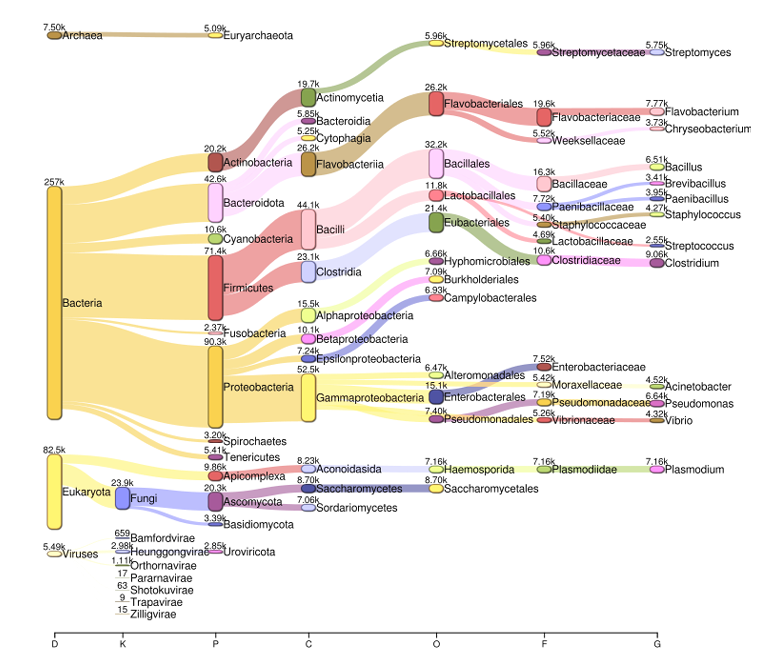

High-quality reads obtained after preprocessing were taxonomically classified using Kraken2 to characterize the microbial composition associated with *Deroceras laeve* samples.

### Custom Database Construction

A custom multi-kingdom reference database was built using Kraken2 and NCBI taxonomy resources.

The database included the following libraries:

-   Bacteria\
-   Archaea\
-   Viruses\
-   Fungi\
-   Human\
-   Plant\
-   Animal

``` bash
module load kraken/2.0.8-beta

kraken2-build --download-taxonomy \
  --threads 20 \
  --db multi_kingdom_db

kraken2-build --download-library bacteria --threads 20 --db multi_kingdom_db
kraken2-build --download-library viral   --threads 20 --db multi_kingdom_db
kraken2-build --download-library fungi   --threads 20 --db multi_kingdom_db
kraken2-build --download-library archaea --threads 20 --db multi_kingdom_db
kraken2-build --download-library human   --threads 20 --db multi_kingdom_db
kraken2-build --download-library plant   --threads 20 --db multi_kingdom_db
kraken2-build --download-library animal  --threads 20 --db multi_kingdom_db

kraken2-build --build \
  --db multi_kingdom_db \
  --threads 30
```

### Read Classification

Filtered paired-end reads generated after Cutadapt trimming were classified against the custom database.

``` bash
kraken2 --db multi_kingdom_db \
  --threads 20 \
  --paired dlaeve1_R1cut.fastq dlaeve1_R2.fastq \
  --output dlaeve1.kraken \
  --report dlaeve1.report
```

### Output Reports

For each sample, Kraken2 generated:

Classification output files `(*.kraken)`

Taxonomic summary reports`(*.report)`

These reports were used for downstream visualization and abundance analyses.

## Exploratory Visualization in Pavian

Kraken2 reports were explored in Pavian to inspect taxonomic assignments and generate Sankey diagrams summarizing multi-kingdom composition.

```{r, eval=FALSE}
pavian::runApp(port = 5000)
```

{width="600"}

This step facilitated rapid inspection of kingdom-level distributions across samples.

## BIOM Table Generation

Per-sample Kraken2 reports were merged into a BIOM-formatted table for downstream analyses in R.

``` bash
kraken_biom.py \
  dlaeve1.report \
  --fmt json \
  -o dlaeve_taxonomy.biom
```

### Transition to Downstream Analyses

The resulting BIOM table was imported into R using the phyloseq package for taxonomic filtering, abundance summaries, and graphical analyses.

These steps are detailed in the next chapter: Taxonomic Analysis.
